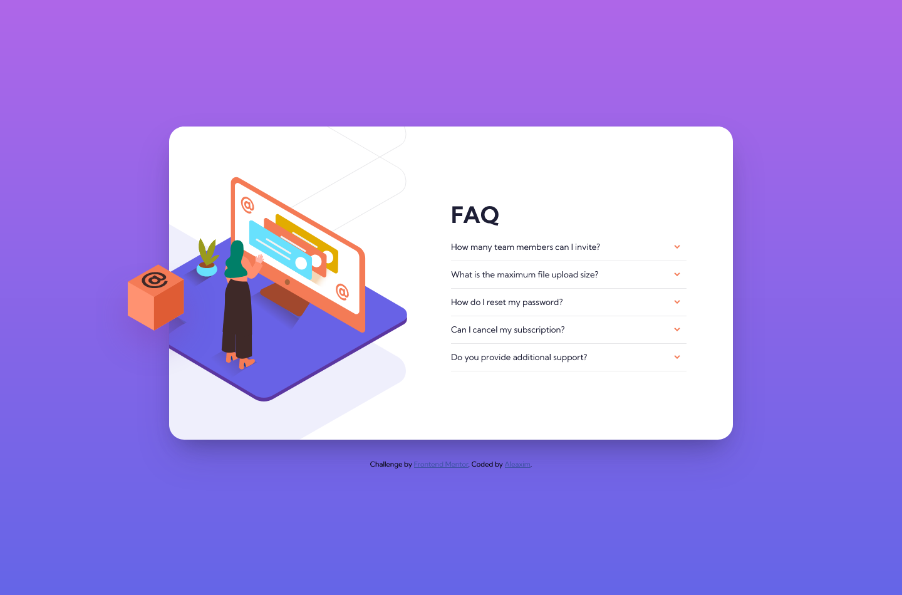

# Frontend Mentor - FAQ accordion card solution

This is a solution to the [FAQ accordion card challenge on Frontend Mentor](https://www.frontendmentor.io/challenges/faq-accordion-card-XlyjD0Oam). Frontend Mentor challenges help you improve your coding skills by building realistic projects.

## Table of contents

- [Frontend Mentor - FAQ accordion card solution](#frontend-mentor---faq-accordion-card-solution)
  - [Table of contents](#table-of-contents)
  - [Overview](#overview)
    - [The challenge](#the-challenge)
    - [Screenshot](#screenshot)
    - [Links](#links)
  - [My process](#my-process)
    - [Built with](#built-with)
    - [Continued development](#continued-development)
    - [References](#references)
  - [Author](#author)

## Overview

### The challenge

Users should be able to:

- View the optimal layout for the component depending on their device's screen size
- See hover states for all interactive elements on the page
- Hide/Show the answer to a question when the question is clicked

### Screenshot

### Links

- Solution: [Github Repo](https://github.com/aleaxim/frontendm/tree/master/faq-accordion-card)
- Live Site: [FAQ Accordion](https://aleaxim.github.io/frontendm/faq-accordion-card/)

## My process

### Built with

- HTML5 markup
- CSS Custom properties
- JavaScript, JQuery
- Flexbox
- Media Query

### Continued development

- Will continue to get comfortable with CSS Flexbox and position properties.
- When to use ch units.
- Recreate this without using javascript.
  <!--  -->

### References

- [Filled Background](https://stackoverflow.com/questions/16841323/making-gradient-background-fill-page-with-css/16841457) - For filling the whole page with a gradient background.

- [Collapsible](https://www.w3schools.com/howto/howto_js_collapsible.asp) - For creating the collapsible section.

- [Grid vs Flexbox](https://developer.mozilla.org/en-US/docs/Web/CSS/CSS_Grid_Layout/Relationship_of_Grid_Layout) - A read about the uses of css grid and flexbox.

- [Style in Active state](https://stackoverflow.com/questions/23661927/keep-button-in-active-state-until-clicked-upon-again) - For keeping a button in active state until clicked upon again.

- [Object-position](https://developer.mozilla.org/en-US/docs/Web/CSS/object-position) - For specifiying an object's position within a container.

- [Half Half](https://stackoverflow.com/questions/33393544/how-can-i-make-a-half-half-layout-with-some-text-using-display-flex/33393800) - For equally dividing a flexbox into half.

- [Center a Div](https://css-tricks.com/centering-css-complete-guide/) - Used in centering a flexbox.

- [Auto-rezied Image](https://stackoverflow.com/questions/3029422/how-do-i-auto-resize-an-image-to-fit-a-div-container) - For auto resizing an image to fix a div container.

- [Flexbox Guide](https://css-tricks.com/snippets/css/a-guide-to-flexbox/) - For using the CSS flexbox.

- [Min-height](https://css-tricks.com/almanac/properties/m/min-height/) - Gave an idea on how to enlarge an image but cropped on a certain size.

## Author

- Github - [@aleaxim](https://github.com/aleaxim)
