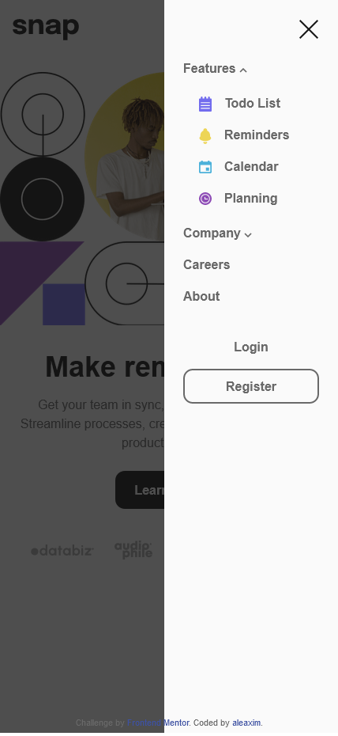

# Frontend Mentor - Intro section with dropdown navigation solution

This is a solution to the [Intro section with dropdown navigation challenge on Frontend Mentor](https://www.frontendmentor.io/challenges/intro-section-with-dropdown-navigation-ryaPetHE5). Frontend Mentor challenges help you improve your coding skills by building realistic projects.

## Table of contents

- [Frontend Mentor - Intro section with dropdown navigation solution](#frontend-mentor---intro-section-with-dropdown-navigation-solution)
  - [Table of contents](#table-of-contents)
  - [Overview](#overview)
    - [The challenge](#the-challenge)
    - [Screenshot](#screenshot)
    - [Links](#links)
  - [My process](#my-process)
    - [Built with](#built-with)
  - [Author](#author)

## Overview

### The challenge

Users should be able to:

- View the relevant dropdown menus on desktop and mobile when interacting with the navigation links
- View the optimal layout for the content depending on their device's screen size
- See hover states for all interactive elements on the page

### Screenshot

  
   

### Links

- Solution: [Github Repo](https://github.com/aleaxim/frontendm/tree/master/intro-section-with-dropdown-navigation/)
- Live Site: [Live Preview](https://aleaxim.github.io/frontendm/intro-section-with-dropdown-navigation/)

## My process

### Built with

- Tailwind CSS
- Flexbox
- CSS Grid
- Mobile-first workflow
- Semantic HTML5 markup

## Author

- Github - [@aleaxim](https://github.com/aleaxim)
